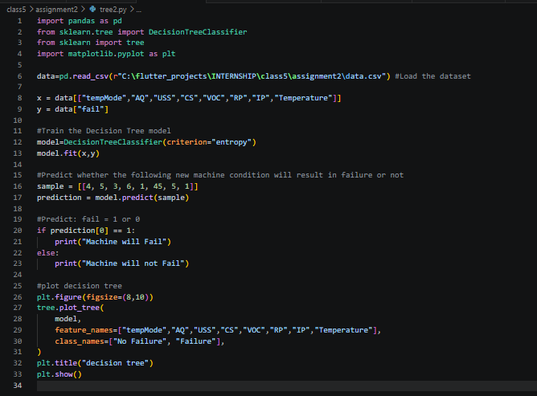
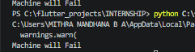
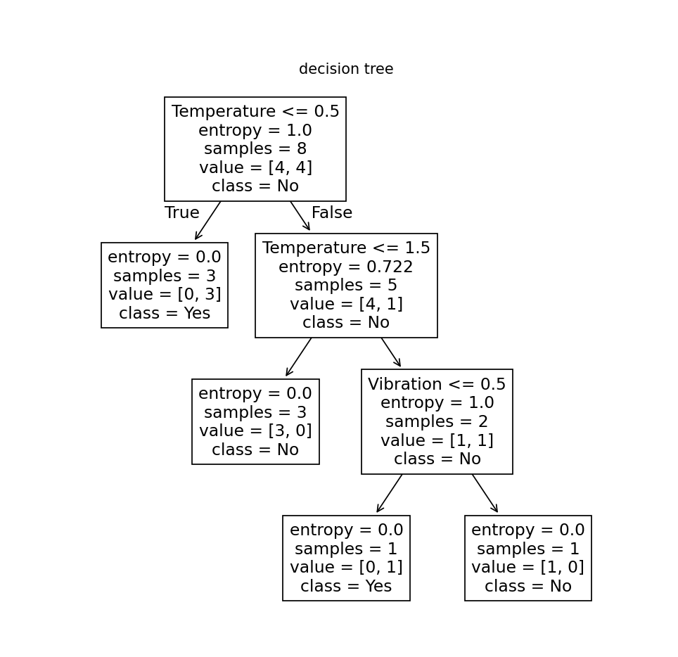

# assignment7-Decision-Tree-2
Assignment 7 about Decision Tree using Entropy splitting done by Mithra Nandhana BA

## Problem Statement
A smart industrial monitoring system collects sensor data to predict whether a ma-chine will fail or not.
Using the given dataset, build a Decision Tree Classifier to predict machine failure.

## Answer
The code is saved in the `assignment7-Decision-Tree-2/assignment/logistic.py/` along with the csv file containing the data.

The code, the output and the decision tree are given below.

## *Code*

## *Output*

## *Decision Tree*

## Final Answer
Machine will Fail

# What I Learned
By this assignment and class, I learned:
1. Decision Tree

:D
